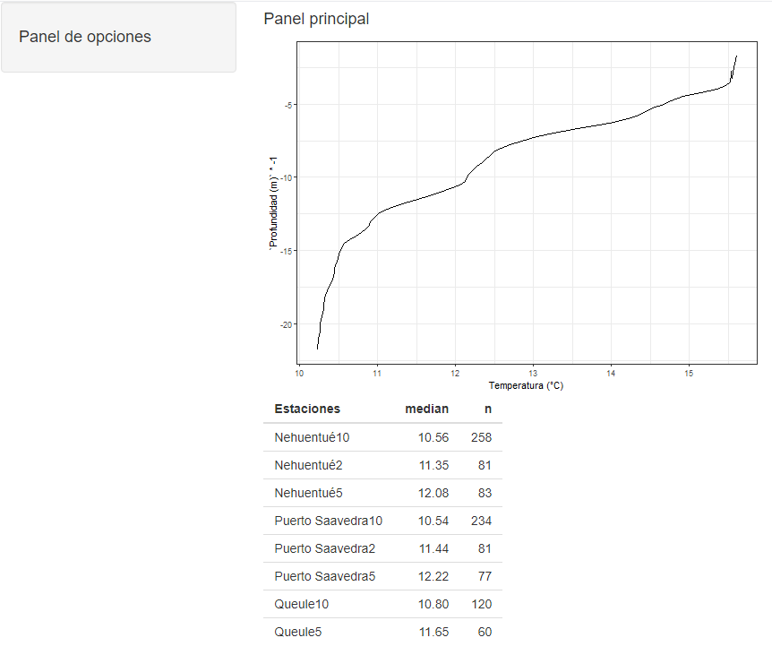
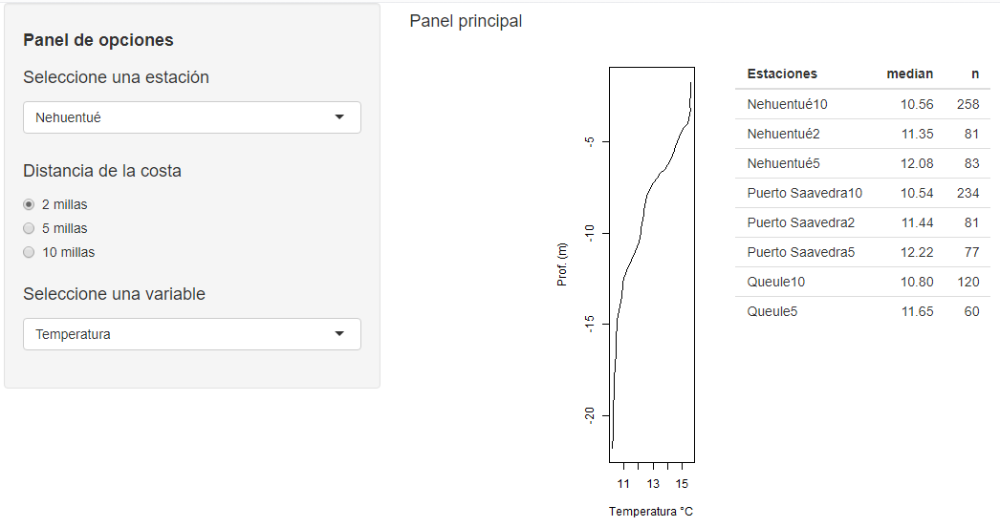

background-image: url(logo_labgrs_color.png)
background-position: center
background-size:40%

```{r setup, include=FALSE}
options(htmltools.dir.version = FALSE)
library(shiny)
library(tidyverse)
library(readxl)
library(DT)

```


---

Librerías utilizadas en esta sesión

```{r eval=F}
library(shiny)
library(tidyverse)
library(readxl)
library(DT)

```


---
class: inverse, center, middle

# INTRODUCCIÓN

---
#Modificando la interacción con la aplicación

--
- Seguiremos trabajando con la aplicación de la clase anterior. 

--
- Esta vez generaremos cambios a partir de la creación de inputs reactivos que alteren la estructura del código en el servidor


--
.center[]

--
.center[.footnote[*Consejo:* Para realizar adecuadamente la incorporación de elementos reactivos es bueno tener una idea preliminar de lo que queremos lograr, y como queremos que el usuario se relacione con la aplicación.]]

---
#Agregando entradas reactivas

--
- Que la gente pueda seleccionar la estación por nombre
```{r eval=FALSE}
selectInput("select", label = h4("Seleccione una estación"), 
            choices = list("Nehuentué" = "Nehuentué", "Queule" = 'Queule',
                           "Puerto Saavedra" = "Puerto Saavedra"),
            selected = 'Nehuentué'),
```

--
- Y por distancia de la costa
```{r eval=F}
radioButtons("millas", label = h4("Distancia de la costa"),
             choices = list("2 millas" = 2, "5 millas" = 5, "10 millas" = 10),
             selected = 2)
```

--
*Importante: las entradas reactivas deben disponer de un nombre (id), siendo este id el que usaremos en nuestro server para identificar el código que gatillan*

---
#Nuestra UI hasta 

--
```{r eval=FALSE}
ui <- fluidPage(sidebarPanel(
                  h4(strong('Panel de opciones')),
                  selectInput("select", label = h4("Seleccione una estación"), 
                              choices = list("Nehuentué" = "Nehuentué", "Queule" = 'Queule',
                                             "Puerto Saavedra" = "Puerto Saavedra"), 
                              selected = 'Nehuentué'),
                  radioButtons("millas", label = h4("Distancia de la costa"),
                               choices = list("2 millas" = 2, "5 millas" = 5, "10 millas" = 10), 
                               selected = 2)
                             ),
                mainPanel(
                  h4('Panel principal'),
                  plotOutput(outputId = 'perfil',height = 500),br(),
                  tableOutput(outputId = 'resumen')
                )
)
```

---
#Trabajando con las entradas reactivas

--
- El código de la tabla será similar, solo cambiaremos el código del gráfico para este ejemplo.

--
```{r eval=F}
#plot
  output$perfil <- renderPlot({
    #station name using reactive input
    data.filter <- paste(input$select,input$millas,sep = '')
    #subset data for ploting
    plot.data <- tabla %>% filter(Estaciones==data.filter) %>% 
      mutate(prof = `Profundidad (m)`*-1) %>% as.data.frame()
    
    #plot
    par(mar = c(4, 4, 2, 2)) #only for margins control
    plot(plot.data[,'Temperatura (°C)'], plot.data[,'prof'], type='l',xlab = 'Temperatura °C', ylab='Prof. (m)')
  })
```

---
#Nuestro server

--
```{r eval=F}
server <- function(input,output,session){
  #reading data
  tabla <- read_excel('geo459/clase4/Araucania2018_CTD_C1.xls') %>% as.data.frame()
  #rendering outputs
  #Tabla
  output$resumen <- renderTable({
    df.resumen <- tabla %>% group_by(Estaciones) %>%
      summarise(median = median(`Temperatura (°C)`), n = n())
    df.resumen
  })
  
  #plot
  output$perfil <- renderPlot({
    output$perfil <- renderPlot({
      #station name using reactive input
      data.filter <- paste(input$select,input$millas,sep = '')
      #subset data for ploting
      plot.data <- tabla %>% filter(Estaciones==data.filter) %>% mutate(prof = `Profundidad (m)`*-1) %>%
        as.data.frame()
      #plot
      par(mar = c(4, 4, 2, 2)) #only for margins control
      plot(plot.data[,'Temperatura (°C)'], plot.data[,'prof'], type='l',xlab = 'Temperatura °C', ylab='Prof. (m)')
    })
  })
}
```

---
# incorporemos una opción reactiva más

--
```{r eval=F}
selectInput("campo", label = h4("Seleccione una variable"),
            choices = list("Temperatura" = "Temperatura (°C)",
                           "Sigma- t"= 'Sigma T (Kg/m3)',
                           "Salinidad" = "Salinidad (UPS)",
                           "Oxígeno" =  "Oxigeno (ml/L)"),
            selected = 'Temperatura')
```

--
Con esto ahora se puede elegir el campo a graficar

---
# Ordenemos nuestro gráfico y nuestra tabla en el panel principal

--
```{r eval=F}
mainPanel(
  h4('Panel principal'),
          column(plotOutput(outputId = 'perfil',height = 500),width = 3, offset = 2),br(),
          tableOutput(outputId = 'resumen')
                )
```

--
Ahora nuestro gráfico tiene límites y la tabla aparece al lado, no abajo.

---
#Nuestra UI
```{r eval=F}
ui <- fluidPage(sidebarPanel(
  h4(strong('Panel de opciones')),
  selectInput("select", label = h4("Seleccione una estación"), 
              choices = list("Nehuentué" = "Nehuentué", "Queule" = 'Queule',
                             "Puerto Saavedra" = "Puerto Saavedra"), 
              selected = 'Nehuentué'),
  radioButtons("millas", label = h4("Distancia de la costa"),
               choices = list("2 millas" = 2, "5 millas" = 5, "10 millas" = 10), 
               selected = 2),
  selectInput("campo", label = h4("Seleccione una variable"),
              choices = list("Temperatura" = "Temperatura (°C)",
                             "Salinidad" = "Salinidad (UPS)",
                             "Oxígeno" =  "Oxigeno (ml/L)"),
              selected = 'Temperatura')
),
mainPanel(
  h4('Panel principal'),
  column(plotOutput(outputId = 'perfil',height = 500),width = 3, offset = 2),br(),
  tableOutput(outputId = 'resumen')
)
)

```

---
class: middle
.center[]

---
#Modifiquemos nuestro gráfico reactivo

--
```{r eval=F}
 output$perfil <- renderPlot({
    #making plot data
    data.filter <- paste(input$select,input$millas,sep = '') #station's name
    plot.data <- tabla %>% filter(Estaciones==data.filter) %>% 
      mutate(prof = `Profundidad (m)`*-1) %>% as.data.frame()
    
    plot.data$variable <- plot.data[, as.vector(input$campo[[1]])]  #generalized data frame
    #plot
    par(mar = c(4, 4, 2, 2))#margin's control
    plot(plot.data[,'variable'], plot.data[,'prof'], type='l',xlab = input$campo, ylab='Prof. (m)',
         main = paste(input$select, ':', input$campo[[1]])) #plot
  })
```

---

```{r eval=F}
server <- function(input, output, session) {
  #reading data
  tabla <- read_excel('data/Araucania2018_CTD_C1.xls') %>% as.data.frame()
  
  #rendering outputs
  #Tabla
  output$resumen <- renderTable({
    df.resumen <- tabla %>% group_by(Estaciones) %>%
      summarise(median = median(`Temperatura (°C)`), n = n())
    df.resumen
  })
  #plot
  output$perfil <- renderPlot({
    #making plot data
    data.filter <- paste(input$select,input$millas,sep = '') #station's name
    plot.data <- tabla %>% filter(Estaciones==data.filter) %>%mutate(prof = `Profundidad (m)`*-1) %>%
      as.data.frame() 
    plot.data$variable <- plot.data[, as.vector(input$campo[[1]])] #generalized data frame
    #plot
    par(mar = c(4, 4, 2, 2))#margin's control
    plot(plot.data[,'variable'], plot.data[,'prof'], type='l',xlab = input$campo, 
         ylab='Prof. (m)', main = paste(input$select, ':', input$campo[[1]])) #plot
  })
}
```

---
class: inverse,center, middle

# ¿PREGUNTAS?

---

class: inverse,center, middle

# PRÓXIMA SEMANA SEGUIMOS <br> LES TOCA A USTEDES! <br> 

