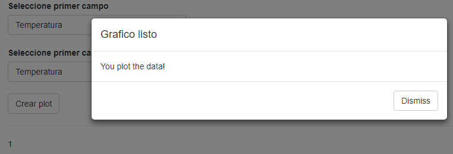
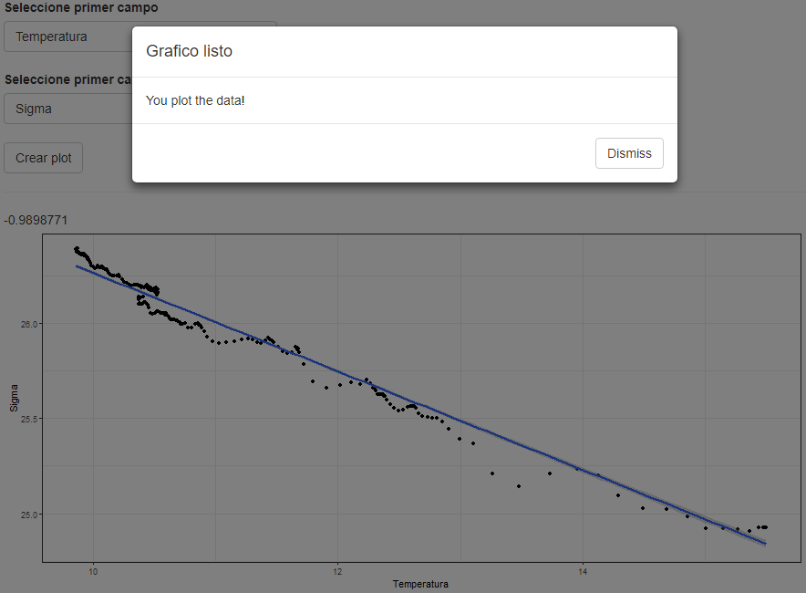
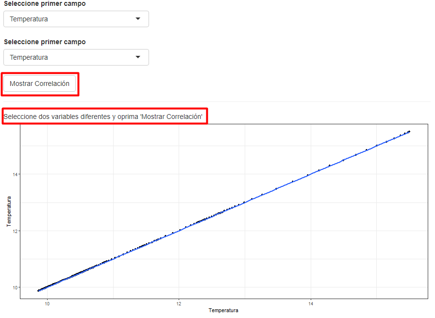
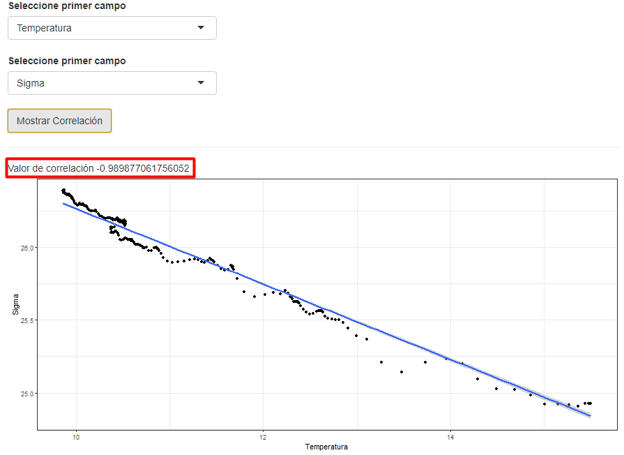

background-image: url(logo_labgrs_color.png)
background-position: center
background-size:40%

```{r setup, include=FALSE}
options(htmltools.dir.version = FALSE)
library(shiny)
library(tidyverse)
```


---

Librerías utilizadas en esta sesión

```{r eval=F}
library(shiny)
library(tidyverse)
```


---
class: inverse, center, middle

# INTRODUCCIÓN

---
#Reactividad: 

--
- Dentro del server podemos utilizar conductores reactivos creados como funciones. [Clase 6](https://joselastra.github.io/geo459/clase6/06_reactivity.html)

--
- En esta sesión, veremos los conductores reactivos comunes empleados en shiny y qué es lo que nos permiten realizar

--
## ¿Y por qué no utilizamos solo funciones creadas?

--
- Los conductores nos permiten crear elementos en caché y evitar cálculos innecesarios dentro de la aplicación.

--
- La idea general es ver su utilidad en un contexto simple, para permitir luego su aplicación en un contexto más operativo.


---
# reactive() y eventReactive()

--
- Crearemos primero un script demo usando datos random

--

UI
```{r eval=F}
library(shiny)
library(tidyverse)

ui <- fluidPage(
  selectInput('campo1',label = 'Seleccione primer campo',choices = c("Temperatura","Salinidad",
                                                                     "Sigma" ,"Oxigeno_disuelto")),
  selectInput('campo2',label = 'Seleccione primer campo',choices = c("Temperatura","Salinidad",
                                                                     "Sigma" ,"Oxigeno_disuelto")),
  actionButton('plot','Crear plot'),hr(),
  textOutput('corr'),
  plotOutput('plot')
)
```

---
Server

--
```{r eval=F}
server <- function(input, output, session) {
 #load  data
  data.CTD <- read.csv('CTD_data.csv',sep = ';')
  
  #reactive expression
  data1 <- reactive(
    cor(data.CTD[,input$campo1],data.CTD[,input$campo2])
  )
  # salida corr
  output$corr <- renderText({ data1() })
  #event reactive expression
  plot1 <- eventReactive(input$plot,{
    ggplot(data = data.CTD, aes_string(x = input$campo1, y = input$campo2)) + geom_point() + 
      geom_smooth(method = 'lm') + theme_bw()
  }) 
  #salida plot
  output$plot <- renderPlot({ plot1() })

}
```

---
background-image: url(app1.png)
background-position: center
background-size:70%

---
# Consideraciones

- Ambas expresiones reactivas permiten almacenar valores para poder ser empleados en otra expresión.

--
- *eventReactive()* a diferencia de *reactive()*, va a depender de expresiones reactivas que se especifiquen y no de todas las expresiones reactivas que estén en la sección de ejecución. 

--
- En nuestro caso, el *actionButton* es quien ordena que se ejecute el código y llama al resto de los elementos reactivos de la UI.

--
- *reactive()* es bastante útil en ciertos contextos simples, generando dependencias constantes que se ejecutan al ser llamadas.

--
- *eventReactive()* da mayor control sobre las expresiones y sus dependencias, aunque uno nunca puede controlar todo.

---
#observe() y observeEvent()

--
- A diferencia de la familia *reactive*, los *observers* no almacenan valores ni cálculos para ser usados en otras expresiones (no almacenan información en caché)

--
- Son más parecidos a una salida, y permiten evidenciar de manera clara los cambios en las entradas reactivas.

--
- Los *observers* son empleados para mandar "efectos" a la web visualizable. *Serán escenciales para nuestras aplicaciones de webmapping*

---
#Ejemplo

--
Al código de nuestro server le agregaremos lo siguiente:

--
```{r eval=F}
 # observer
  observe({
    input$plot
    showModal(modalDialog(
      title = "Grafico listo",
      "You plot the data!"
    ))
  })

```

--
.center[]

---
#Importante

--
- No acepta condiciones *NULL*, por tanto se ejecuta aunque no hagamos nada (*side-effects*)

--
.center[]

--
- Y obviamente, se ejecutará cuando realicemos la acción

--
- En ese contexto *observeEvent()* se vuelve más apropiado.

---
Modfiquemos lo anterior con la siguiente expresión:

--
```{r eval=F}
 # observer
  observeEvent(input$plot,{
    showModal(modalDialog(
      title = "Grafico listo",
      "You plot the data!"
    ))
  })
```

--
- Con esto podemos controlar no solo 1, sino que varias expresiones y entradas reactivas en un bloque de código.

---
#rectiveValues(): usando expresiones con mayor sentido

--
- *reactiveValues()* nos permite almacenar valores para ser usados posteriormente en expresiones reactivas.

--
- Puede ser util en general para manipulación de datos.

--
- Para este ejemplo modificaremos un poco nuestra UI y nuestro server

--
```{r eval=F}
ui <- fluidPage(
  selectInput('campo1',label = 'Seleccione primer campo',choices = c("Temperatura","Salinidad",
                                                                     "Sigma" ,"Oxigeno_disuelto")),
  selectInput('campo2',label = 'Seleccione primer campo',choices = c("Temperatura","Salinidad",
                                                                     "Sigma" ,"Oxigeno_disuelto")),
  actionButton('submit','Mostrar Correlación'),hr(),
  textOutput('corr'),
  plotOutput('plot')
)
```
---
En nuestro server estos son los cambios:

--
```{r eval=F}
server <- function(input, output, session) {
 #load  data
  data.CTD <- read.csv('CTD_data.csv',sep = ';')
  # reactiveValues
  text_corr <- reactiveValues(text = "Seleccione dos variables diferentes", 
                              correlacion = " y oprima 'Mostrar Correlación'" )
  #reactive expression
  data1 <- reactive( cor(data.CTD[,input$campo1],data.CTD[,input$campo2]))
  #observe actualiza el valor dentro de reactive values
  observeEvent(input$submit,
               { text_corr$text <- 'Valor de correlación'
                 text_corr$correlacion <- data1()
               })
  # salida corr
  output$corr <- renderText({ c(text_corr$text,':',text_corr$correlacion) })
  #event reactive expression
  plot1 <- reactive({
    ggplot(data = data.CTD, aes_string(x = input$campo1, y = input$campo2)) + geom_point() + 
      geom_smooth(method = 'lm') + theme_bw()
  }) 
  #salida plot
  output$plot <- renderPlot({ plot1() })
}
```

---
class: center, middle
.pull-left[]
.Pull-right[]
---
class: inverse,center, middle

# ¿PREGUNTAS?

---

class: inverse,center, middle

# PRÓXIMA SEMANA: <br> CREANDO FUNCIONES Y USÁNDOLAS EN NUESTRA APP <br> 

