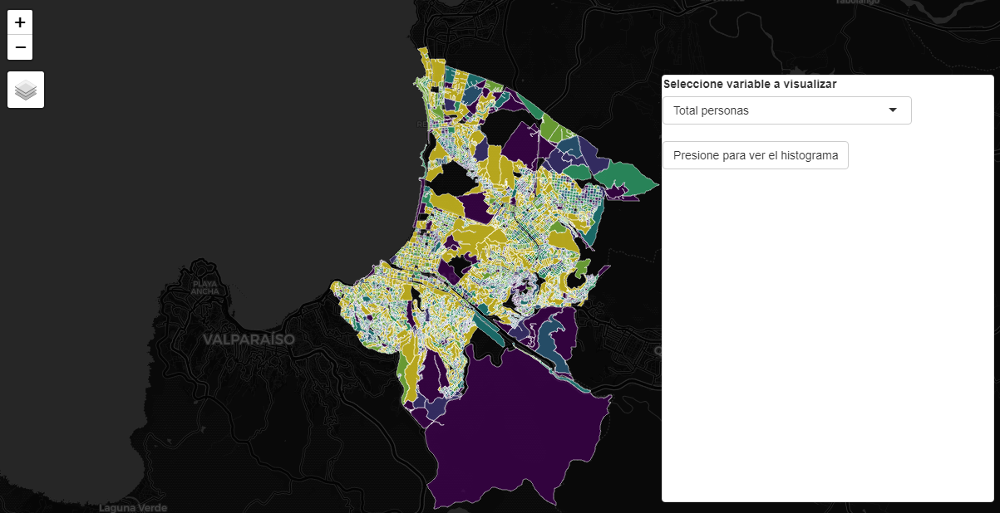
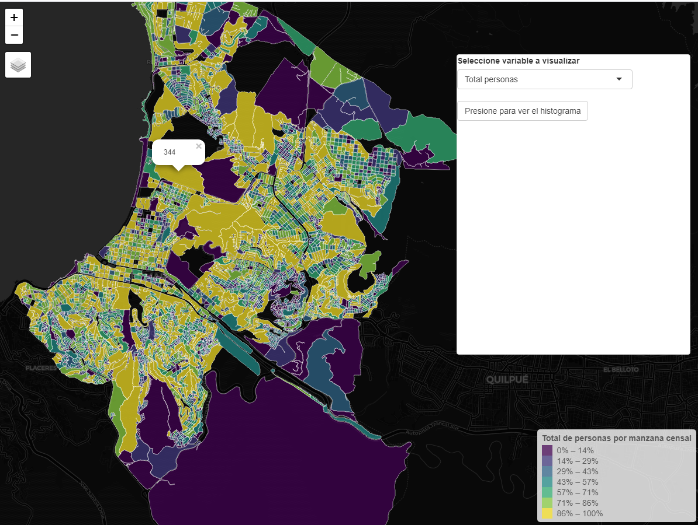

background-image: url(logo_labgrs_color.png)
background-position: center
background-size:40%

```{r setup, include=FALSE}
options(htmltools.dir.version = FALSE)
library(shiny)
library(leaflet)
library(tidyverse)
library(sf)
library(shinybusy)
```


---

Librerías utilizadas en esta sesión

```{r eval=F}
library(shiny)
library(leaflet)
library(tidyverse)
library(sf)
library(shinybusy)
```


---
class: inverse, center, middle

# INTRODUCCIÓN

---
#Elementos reactivos

--
- Ya hemos visto que podemos generar racciones y cambios a partir de los inputs en nuestra UI

--
- Adicionalmente, podemos usar interacciones particulares que se realicen en el mapa.

--
- Para revisar algunas de estas reacciones, usaremos la aplicación vista la semana pasada.


---
class: middle
.center[]

---
#Agregando leyenda reactiva

--
- Modificaremos el código de generación de nuestra leyenda y nuestro proxy

--
```{r eval=F}
#preparando paletas
    tabla <- shp[,] %>% as.data.frame() 
    dominio <- tabla[, input$campo[[1]]]
    #creando paleta de colores dinámica
    pal <- colorQuantile(palette = "viridis",domain = dominio,n = 7)
    #proxy Map
    proxyMap <- leafletProxy('map')
```

Este código asegura una mejor distribución de los colores considerando el sesgo de los datos de entrada.

--
- Para agregar la leyenda, usaremos la funcion `addLegend()` en cada sección condicional dentro de nuestro *observer* para el proxy.

--
```{r eval=F}

  if(input$campo[[1]] == 'PERSONAS'){
      proxyMap <- proxyMap %>% clearShapes() %>% clearControls() %>% 
        addPolygons(data = shp,group = 'Manzanas', fillColor = ~pal(PERSONAS), fillOpacity = 0.7,
                    stroke = 0.1,color = 'white',weight = 1, smoothFactor = 0.2) %>%
        addLegend("bottomright", pal = pal, values = dominio, 
                  title = "Total de personas por manzana censal",opacity = 0.7,group = 'Leyenda')
    }
```


---
#Etiquetas de datos

--
- Podemos etiquetar de varias maneras dentro de *leaflet*

--
- *Ejemplo 1: popUp*

```{r eval=F}
  if(input$campo[[1]] == 'PERSONAS'){
      proxyMap <- proxyMap %>% clearShapes() %>% clearControls() %>% 
        addPolygons(data = shp,group = 'Manzanas', fillColor = ~pal(PERSONAS), fillOpacity = 0.7,
                    stroke = 0.1,color = 'white',weight = 1, smoothFactor = 0.2, 
                    popup = ~htmlEscape(PERSONAS)) %>%
        addLegend("bottomright", pal = pal, values = dominio,
                  title = "Total de personas por manzana censal",
                  opacity = 0.7,group = 'Leyenda')
    }
```

--
De esta forma al pinchar un polígono aparecerá su valor

---

--
- *Ejemplo 2: labels*

--
```{r eval=F}
if(input$campo[[1]] == 'PERSONAS'){
      proxyMap <- proxyMap %>% clearShapes() %>% clearControls() %>% 
        addPolygons(data = shp,group = 'Manzanas', fillColor = ~pal(PERSONAS), fillOpacity = 0.7,
                    stroke = 0.1,color = 'white',weight = 1, smoothFactor = 0.2, 
                    label = ~htmlEscape(PERSONAS)) %>%
        addLegend("bottomright", pal = pal, values = dominio,
                  title = "Total de personas por manzana censal",
                  opacity = 0.7,group = 'Leyenda')
    }
```
--
Empleando este argumento, al desplazarnos por la capas aparecerá la información.

---
class: middle
.center[



]
.footnote[El resultado es bastante similar]
---
class: inverse,center, middle

# ¿PREGUNTAS?


---

class: inverse,center, middle

# PRÓXIMA SEMANA SEGUIMOS <br> MEJORANDO NUESTRA APP <br> 

