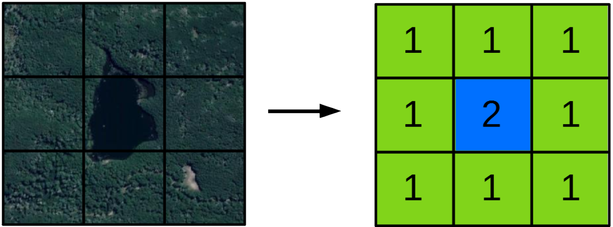
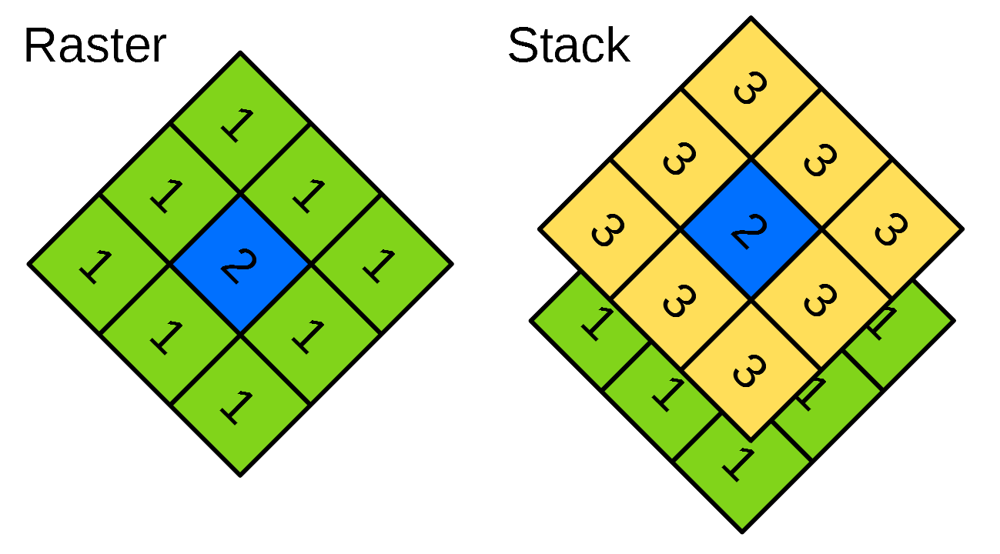
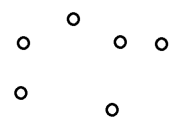
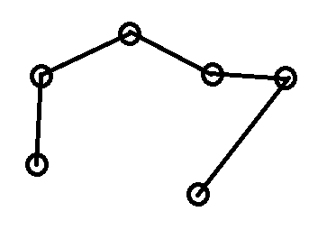
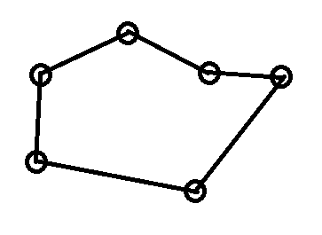
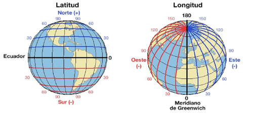
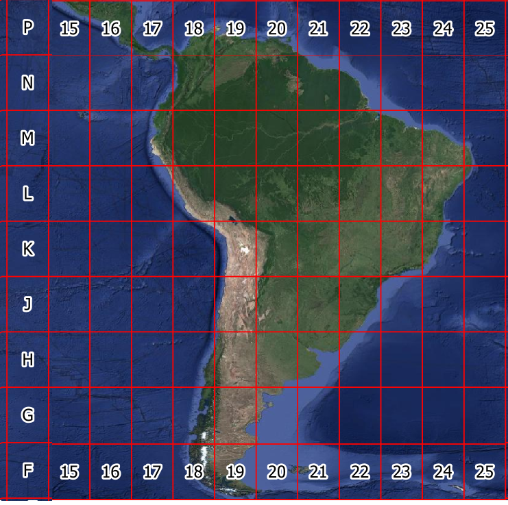
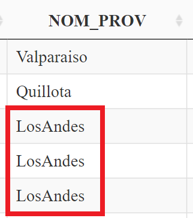
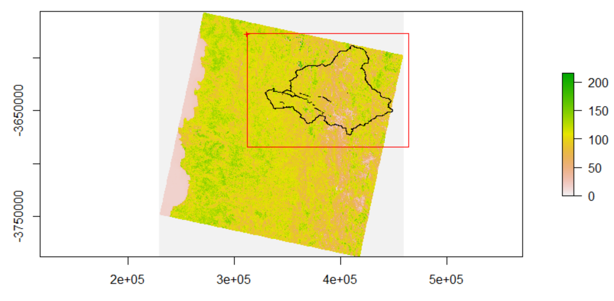

background-image: url(logo_labgrs_color.png)
background-position: center
background-size:50%

```{r setup, include=FALSE}
options(htmltools.dir.version = FALSE)
library(tidyverse)
library(corrplot)
library(readxl)
library(npphen)
library(TTR)
library(scales)
library(ggplot2)
library(tidyquant)
library(dplyr)
library(DT)

```

---
class: inverse, center, middle

# Manipulación de Geo-datos

---
# Raster o imágen

--
Se puede definir como una matríz de datos numérica, que tienen una extensión dada y un tamaño de píxel específico.

```{r echo = F, out.width = '45%', fig.align="center"}

```

--

En R se pueden dividir en objetos tipo raster (una banda) o stack (dos o más bandas):
```{r echo = F, out.width = '50%', fig.align="center"}

```
---

# Vectores

--
- Puntos

```{r echo = F, out.width = '15%', fig.align="center"}

```

--
- Lineas

```{r echo = F, out.width = '15%', fig.align="center"}

```

--
- Polígonos

```{r echo = F, out.width = '15%', fig.align="center"}

```
---
# Algunas operaciones con vectores y rasters

--

Buffers

- Crea una zona de una cantidad de metros dada alrededor de nuestro vector original 

--

Intersección 

- Como resultado nos muestra sólo las áreas de intersección entre dos polígonos

--

Clip 

- Corta un polígono a la extensión de otro

--

Máscara 

- Enmascara un polígono a la extensión y contorno de otro

--

Consultar proyección y reproyectar

--

Otros 
---
# Sistema de coordenadas y proyecciones

--
¿Cómo proyectamos el planeta para poder "mapearlo"? 
--

- Grados, minutos y segundos (Latitud - Longitud)

```{r echo = F, out.width = '30%', fig.align="center"}

```
<font size="2"> Img: http://www.pasionporvolar.com/latitud-y-longitud-navegacion-aerea/ </font> 

--

- Sistema de coordenadas Universal Transversal de Mercator (UTM)

```{r echo = F, out.width = '20%', fig.align="center"}

```
---
# ¿Cómo trabajar con geo-datos desde RStudio?

--
Para leer y realizar algunas operaciones básicas necesitaremos las librerías "raster" y "rgdal" 
--
```{r  eval=F}
#Instalar librerías
install.packages("raster")
install.packages("rgdal")
install.packages("GISTools")
```
--
Si ya tenemos instaladas las liberías utilizaremos la función "library()"

```{r  echo=T, eval=T, message=F}
#Habilitar librerías
library(raster)
library(rgdal)
library(GISTools)
```
--

Para leer un archivo debemos tener claro la carpeta donde se encuentran nuestros archivos y utilizar las funciones "readOGR()" y "raster()"

```{r  echo=T, eval =T}
dir <- "~/geo_datos/valparaiso" # Aquí debe seleccionar su directorio

```
---

La función "readOGR()" se utiliza de la siguiente manera:

```{r, results='hide', fig.align='center'}
valpo <- readOGR(dsn=path.expand(dir), layer="valparaiso")
#dsn = Se utiliza la función "path.expand()" y la dirección de nuestro archivo
#layer = Se utiliza el nombre de nuestro archivo vector, sin utilizar la extensión ".shp"
plot(valpo)

```
---
# Revisar información básica de nuestro vector

--
Información básica del vector mediante la función "summary()":

```{r}
summary(valpo)
```
---
Consultar la tabla de atributos, función "as.data.frame()":

```{r}
tabla_atributos <- as.data.frame(valpo)
```

```{r echo=F}
datatable(tabla_atributos, class = 'cell-border stripe',rownames = FALSE,options = list(pageLength = 10))
```
---
# Seleccionar un polígono según la tabla de atributos

--
Debemos fijarnos en la tabla de atributos, principalmente el nombre de la columna y nombre del atributo a elegir, en este ejemplo seleccionaremos la provincia de Los Andes:

```{r echo = F, out.width = '10%', fig.align="center"}

```
--
En este caso, la columna es "NOM_PROV" y Los Andes está escrito "LosAndes"

--
```{r}
LAndes <- valpo[valpo$NOM_PROV=="LosAndes",] # IMPORTANTE: no olvidar la "," al final del código
```
```{r out.width = '20%', fig.align="center"}
plot(LAndes)
```
---
Para leer un archivo raster podemos utilizar las siguientes funciones:
- raster(): para leer sólo una banda a elección
- stack(): para leer la totalidad de bandas de un archivo

```{r, results='hide', fig.align='center', out.width = '35%'}
ras_band_1 <- raster("~/geo_datos/valparaiso/valparaiso.tif", band = 1)
# Seleccionamos la banda mediante el argumento "band ="
ras_stack <- stack("~/geo_datos/valparaiso/valparaiso.tif")
plot(ras_band_1)
```
---
# Proyecciones

--
Antes de trabajar con nuestros geo-datos, debemos revisar y asegurarnos de que nuestros archivos tengan la misma proyección

--

```{r}
projection(valpo)
```

```{r}
projection(ras_band_1)
```
--

Para que ambos archivos tengan la misma proyección, se recomienda reproyectar el vector al sistema de coordenadas del objeto raster, para esto se utilizará la función "spTransform()"

--

```{r}
proj <- projection(ras_band_1)
# Creamos un objeto con la proyección de nuestro archivo raster

valpo_utm <- spTransform(valpo, proj)
projection(valpo_utm)
```
---
# Dissolve

--
Implica la simplificación de subdivisiones dentro de una unidad geométrica, se puede realizar mediante dos funciones en R "gUnaryUnion()" o "aggregate()"
```{r}
# Forma 1
LAndes_utm <- spTransform(LAndes, proj)
LAndes_diss <- gUnaryUnion(LAndes_utm, LAndes_utm$NOM_PROV)
# Forma 2
LAndes_diss <- aggregate(LAndes_utm, by="NOM_PROV")
```
```{r out.width = '30%', fig.align="center"}
plot(LAndes_diss)
```
---
# Buffers o área de influencia

--
Para este proceso necesitamos que nuestro objeto vector este en coordenadas UTM y la función "gBuffer()":

--
```{r}
# Utilizaremos el objeto creado anteriormente "proj"
LAndes_diss_buff1 <- gBuffer(LAndes_diss, width = -5000, byid=TRUE)
LAndes_diss_buff2 <- gBuffer(LAndes_diss, width = 5000, byid=TRUE)
```
--

```{r out.width = '40%', fig.align="center"}
plot(LAndes_diss_buff2, border = "blue") # Buffer externo
plot(LAndes_diss, col = "Yellow", add = T) # Original
plot(LAndes_diss_buff1, border = "red", add = T) # Buffer interno
```
---
# Clip y Mask

--
Para este ejemplo trabajaremos mezclando archivos raster y vectores, lo primero es verificar que estén en la misma proyección:
```{r}
projection(ras_band_1); projection(LAndes_diss)

```
--
Al corroborar ambas proyecciones, ya podemos realizar nuestros geo-procesos:

```{r out.width = '25%', fig.align="center"}
plot(ras_band_1)
plot(LAndes_diss, add = T)
```
---
Tenemos dos formas de realizar un recorte, la primera es mediante la función "drawExtent()" la cual permite dibujar un cuadrado sobre nuestro plot:

```{r out.width = '15%', fig.align="center"}
plot(ras_band_1)
plot(LAndes_diss, add = T)
```
--
```{r  eval=F}
ext <- drawExtent() # A partir de este momento podemos comenzar a hacer "click" en nuestro mapa
```
--
```{r echo = F, out.width = '30%', fig.align="center"}

```
---
La siguiente forma es obtener las coordenadas para "cortar" nuestro raster a partir de un polígono o área de estudio mediante la función "extent()":

```{r}
ext <- extent(LAndes_diss)
```
--
Una vez obtenidas las coordenadas o "extent" procedemos a cortar mediante la función "crop()"

--
```{r out.width = '30%', fig.align="center"}
ras_clip <- crop(ras_band_1, ext)
plot(ras_clip)
plot(LAndes_diss, add = T)
```
---
Por otro lado, el geo-proceso de enmascarar deja sin datos (NA) a todos los píxeles que estan fuera del área de nuestro polígono, esto mediante la función "mask()"

--
```{r out.width = '30%', fig.align="center"}
ras_mask <- mask(ras_clip, LAndes_diss) # Utilizamos el area ya "cortada"
plot(ras_mask)
plot(LAndes_diss, add = T)
```
---


---

class: inverse,center, middle

# ¿PREGUNTAS?
