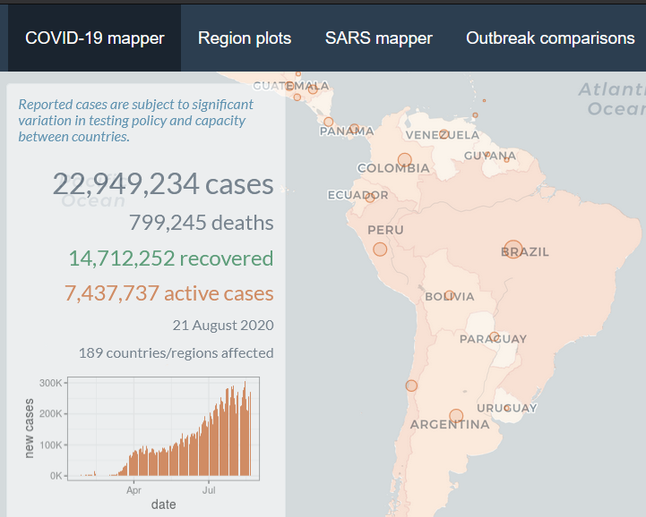
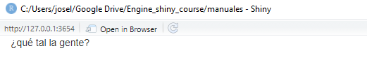

background-image: url(logo_labgrs_color.png)
background-position: center
background-size:40%

```{r setup, include=FALSE}
options(htmltools.dir.version = FALSE)
```


---
# Web GIS vs. Webmapping

--
.pull-right[
- Tecnologías web disponibles para el análisis 
de información espacial
- Utilizan tecnologías web como un método de 
comunicación entre los elementos de un SIG
- Aplicaciones en línea que permiten a los 
usuarios ver o crear mapas en una plataforma web.

]

--
.center[
]
.center[Avraam, 2009]

---
# Webmapping

--
Objetivos principales:

--
- Llevar la cartografía a la web

--
- Permitir el análisis y visualización de datos (hasta cierto punto)

--
.center[]
.center[
Plataforma de monitoreo piloto [PN La Campana](https://labgrs.shinyapps.io/SMF-1/)
]

---
# Consejos de desarrollo

--
- No haga un web map All-in-one

--
- Manténgalo simple (K.I.S)

--
- Usar simbología en todas las capas de una manera clara

--
- Considere la respuesta en todos los dispositivos posibles

--
- Mantenga sus sistema actualizado

--
- Documente!

.right[

]

---
#¿Qué es shiny?

--
- [Shiny](https://shiny.rstudio.com/) es una estructura o marco para la creación de aplicaciones web de todo tipo usando R cómo código fuente. 

--
- Otorga flexibilidad paracrear desde desarrollos simples hasta otros muy complejos, sin tener que disponer de conocimientos de HTML, CSS o JavaScript.

--
- En términos simples: [shiny (1.5.0)](https://cran.r-project.org/web/packages/shiny/index.html) es un paquete de R

.center[]
.center[.footnote[[Shiny, 2020](https://shiny.rstudio.com)]]

---

--
- Shiny puede ser usado en diferentes contextos y con distintos fines. 

--
- No está limitado y depende de la imaginación, planificación estructura y orden de las/los programadores

--
.center[


]
.footnote[- [Shiny MRI](https://haozhu233.shinyapps.io/shinyMRI-contest/?_ga=2.234467934.1955025335.1598126335-517575622.1584381273)]
.footnote[- [COVID-19 tracker](https://vac-lshtm.shinyapps.io/ncov_tracker/?_ga=2.202128721.1955025335.1598126335-517575622.1584381273)]

---
#¿Cuál es la clave?

--
- Disponemos de diferentes [funciones](https://shiny.rstudio.com/gallery/widget-gallery.html) de interfaz de usuario (ui, desde ahora) diseñadas para cosas comunes.
- La lógica del proceso (server) se basa en programación reactiva, que permite identificar el procesamiento a partir de la interacción del usuario.

--
.center[]
.center[.footnote[[Reactivity - An overview, 2017](https://shiny.rstudio.com/articles/reactivity-overview.html)]]


--
- La base está en el uso de conductores ractivos que facilitan el desarrollo de los procesos

---
#Arquitectura básica de una app

--
Una aplicación se va a componer de dos elementos básicos:

--
- Interfaz de usuario

--
```{r eval=F}
## User Interface
ui <- fluidPage(
  "¿qué tal la gente?"
)

```
--
- Server

--
```{r eval=F}

## Server
server <- function(input, output, session) {
  
}

#compiling app
shinyApp(ui, server)
```

---
.center[

]

--
- A partir de aquí, se pueden incorporar más elementos en la UI (entradas y salidas reactivas) y configurar el server para desarrollar ejecutar las acciones específicas.

---
#Conductores reactivos

--
- En el contexto de las coding de shiny, la mayoría de las cosas se efectúan mediante elementos reactivos.

--
- Dentro de estos elementos están los conductores reactivos, que son claves para el funcionamiento adecuado y la creación de dependencias específicas en la app.

--
- Los conductores nos permiten crear elementos en caché y evitar cálculos innecesarios dentro de la aplicación.

--
- Dentro podemos considerar dos familias:
  + Reactives
  + Observers

---
# Reactives

--
- Dentro de la familia de los reactives podemos encontrar:

--
```{r eval=F}
# Permite ejecutar elementos considerando las entradas reactivas dentro de la función
# depende de todas las entradas reactivas
reactive()

# permite ejecutar un código en base a una o varias dependencias particulares 
# si existen las dependencias se puede ejecutar el código dentro de las {}
eventReactive({})

# Permite almacenar valores (vectores, matrices, listas, etc.) y
# actualizarlas en algúna sección del server según se requiera
reactiveValues()
```

---

--
- Todos estos conductores permiten almacenar un objeto y emplearlo en otra función reactiva (salida o conductor)

--
```{r eval=F}
val <- reactive('Código a ejecutar')

val <- eventReactive(input$algo,{
  'código a ejecutar'
})

val <- reactiveValues('valor preveio')

```

---
# Observers

--
- A diferencia de la familia reactive, los observers no almacenan valores ni cálculos en objetos para ser usados en otras expresiones.

--
- Los observers lo que hacen es trasladar cambios en porciones del server a la UI para la visualización de los usuarios.

--
- Son más parecidos a una salida reactiva.

--
- Disponemos de dos tipos de observers

--
```{r eval=F}
#Versión más simple, que está constantemente "monitoreando" cambios
#no permite valores nulos
observe()

#Versión que evaluá el cambio en uno o más inputs
#permite valores nulos (sin cambios)
observeEvent({})
```

--
- Como veremos más adelantes son escenciales para los mapas web.

---

class: inverse,center, middle

# ¿PREGUNTAS?


