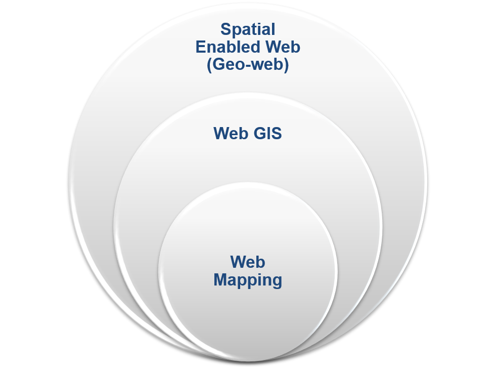
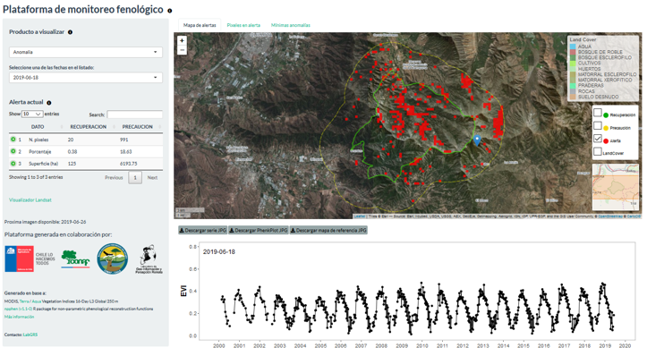

background-image: url(logo_labgrs_color.png)
background-position: center
background-size:40%

```{r setup, include=FALSE}
options(htmltools.dir.version = FALSE)
```


---
# Web GIS vs. Webmapping

--
.pull-right[
- Tecnologías web disponibles para el análisis 
de información espacial
- Utilizan tecnologías web como un método de 
comunicación entre los elementos de un SIG
- Aplicaciones en línea que permiten a los 
usuarios ver o crear mapas en una plataforma web.

]

--
.center[
]
.center[Avraam, 2009]

---
# Webmapping

--
Objetivos principales:

--
- Llevar la cartografía a la web

--
- Permitir el análisis y visualización de datos (hasta cierto punto)

--
.center[]
.center[
Plataforma de monitoreo piloto [PN La Campana](https://labgrs.shinyapps.io/SMF-1/)
]

---
# Consejos de desarrollo

--
- No haga un web map All-in-one

--
- Manténgalo simple (K.I.S)

--
- Usar simbología en todas las capas de una manera clara

--
- Considere la respuesta en todos los dispositivos posibles

--
- Mantenga sus sistema actualizado

--
- Documente!

.right[

]

---
#¿Qué es shiny?

--
- [Shiny](https://shiny.rstudio.com/) es una estructura o marco para la creación de aplicaciones web de todo tipo usando R cómo código fuente. 

--
- Otorga flexibilidad paracrear desde desarrollos simples hasta otros muy complejos, sin tener que disponer de conocimientos de HTML, CSS o JavaScript.

--
- En términos simples: [shiny (1.5.0)](https://cran.r-project.org/web/packages/shiny/index.html) es un paquete de R

.center[]
.center[.footnote[[Shiny, 2020](https://shiny.rstudio.com)]]

---
#¿Cuál es la clave?

--
- Disponemos de diferentes [funciones](https://shiny.rstudio.com/gallery/widget-gallery.html) de interfaz de usuario (ui, desde ahora) diseñadas para cosas comunes.
- La lógica del proceso (server) se basa en programación reactiva, que permite identificar el procesamiento a partir de la interacción del usuario.

--
.center[]
.center[.footnote[[Reactivity - An overview, 2017](https://shiny.rstudio.com/articles/reactivity-overview.html)]]

---

--
- Shiny puede ser usado en diferentes contextos y con distintos fines. 

--
- No está limitado y depende de la imaginación, planificación estructura y orden de las/los programadores

--
.center[


]
.footnote[1. [Shiny MRI](https://haozhu233.shinyapps.io/shinyMRI-contest/?_ga=2.234467934.1955025335.1598126335-517575622.1584381273)]
.footnote[2. [COVID-19 tracker](https://vac-lshtm.shinyapps.io/ncov_tracker/?_ga=2.202128721.1955025335.1598126335-517575622.1584381273)]


