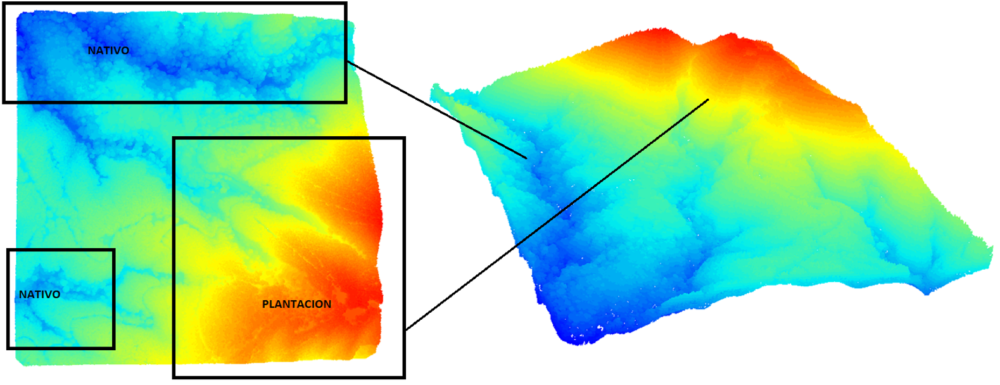
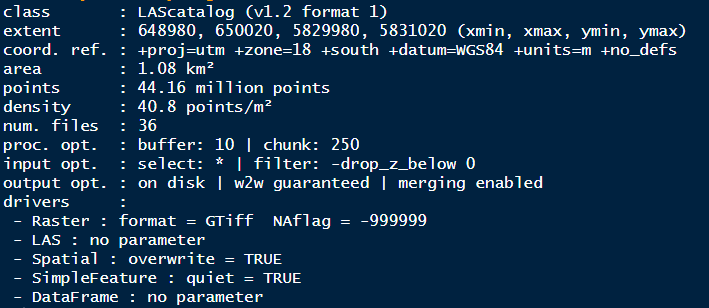
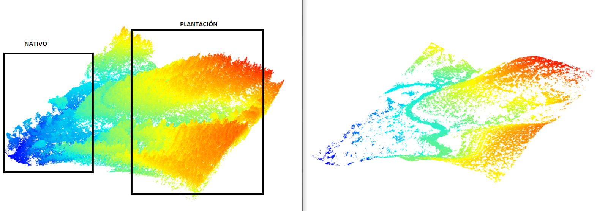

background-image: url(logo_labgrs_color.png)
background-position: center
background-size:50%

```{r setup, include=FALSE}
options(htmltools.dir.version = FALSE)
```

---
class: inverse, center, middle

# INTRODUCCIÓN

---
#Área de prueba

```{r eval=require('leaflet'), echo=F, error=FALSE, out.width='100%',warning=FALSE,message=FALSE}
library(leaflet)
library(tidyverse)
library(sf)
shp<-read_sf('extent_lidar.shp') 
predios<-read_sf('PREDIOS_Hiperespectral.shp')
shp<-st_transform(shp,'+proj=longlat +datum=WGS84 +no_defs ') %>% as_Spatial()
predios<-st_transform(predios,'+proj=longlat +datum=WGS84 +no_defs ') %>% as_Spatial()

leaflet()%>% addTiles()%>% 
  addPolygons(data = predios,color = 'blue', weight = 1, popup = ~NOMBRE,smoothFactor = 0.5,
    opacity = 0.5, fillOpacity = 0.5) %>% addProviderTiles("CartoDB.PositronOnlyLabels") %>% 
  addPolygons(data = shp,color = 'yellow', weight = 1, smoothFactor = 0.5,
    opacity = 1.0, fillOpacity = 0.5,highlightOptions = highlightOptions(color = "white", weight = 2,
      bringToFront = TRUE)) %>% addProviderTiles("CartoDB.PositronOnlyLabels")

```

- Área: 1.08 km²
- Densidad: 40.8 points/m²
---
# LiDAR usando R

- Uso de paquete lidR: Roussel, J. R., Auty, D., DeFlorian, B., & Meador, A. S. (2020). *lidR: Airborne LiDAR Data Manipulation and Visualization for Forestry Applications*, version 3.0.2, acceso: 05 de Julio 2020, Recuperado de: [CRAN](https://CRAN.R-project.org/package=lidR)

```{r out.width='100%',  fig.height=2, eval=require('DiagrammeR'), echo=F,eval=T}
library(DiagrammeR)
grViz("digraph {

graph [layout = dot, rankdir = LR]

# define the global styles of the nodes. We can override these in box if we wish
node [shape = rectangle, style = filled, fillcolor = Linen]

data1 [label = 'LAS files', shape = folder, fillcolor = Beige]
process1 [label =  'Clasificación \n de puntos']
process2 [label = 'Generación \n DTM']
process3 [label =  'Normalización \n de nube de puntos']
process4 [label = 'Canopy Height Model \n (CHM)']
process5 [label = 'Segmentación']
results [label= 'Resultados']

# edge definitions with the node IDs
{data1}  -> process1 -> process2 -> process3 -> process4 -> process5 -> results
}")
```

--
##Aspectos críticos
- Tiempo de procesamiento;
- Clasificación de puntos;
- Generación de un buen DTM, normalización y buen CHM;
- Segmentación de copas óptima para el área;


---

# Aspectos críticos
- **Tiempo de procesamiento**
- Clasificación de puntos
- Generación de un buen DTM, normalización y buen CHM
- Segmentación de copas óptima para el área

.pull-left[
```{r ex1,eval=F}
las<-readLAS('02_LiDAR/01_Muestra/648_5830_3.laz’)
46.86 segundos#<<
```
]
.pull-right[
```{r ex2,eval=F}
las<-readLAScatalog('02_LiDAR/01_Muestra/648_5830_3.laz’)
3.48 segundos#<<
```
]


--
- La función *readLAScatalog()* permite el procesamiento de un archivo completo o de un conjunto de archivos considerando parámetros fijados por el usuario.

--
- Optimiza el proceso de lectura y permite el trabajo multinúcleo.

--
- Se pueden aplicar las funciones a todos los archivos considerando procesamiento wall-to-wall asegurando ajuste entre los archivbos y chunks procesados

---
#Nube de puntos

- Con *readLAS()* podemos abrir individualmente y visalizar
- Con *readLAScatalog()* podemos identificar la información de los archivos y visualizar los parámetros de procesamiento

```{r , echo=T,eval=F}
##processing options for classify
opt_chunk_size(ctg) <- 250 #defining tiles for processing
opt_chunk_buffer(ctg) <- 10 #defining buffer
summary(ctg)
```
.pull-left[]
.pull-right[]


---
# Aspectos críticos
- Tiempo de procesamiento
- **Clasificación de puntos**
- Generación de un buen DTM, normalización y buen CHM
- Segmentación de copas óptima para el área

.center[
Método **Progressive Morphological Filter (pmf)**


]

.footnote[Roussel, Goodbody & Tompalski, 2020.]
---

.center[
Método **Cloth Simulation Function (csf)**


]

.footnote[Roussel, Goodbody & Tompalski, 2020.]
---
# Clasificación

Ejemplo: 
```{r , echo=T,eval=F}
##defining output name and directory
opt_output_files(ctg) <- '02_LiDAR/02_muestraOutput/02a_Ground/ground_{XLEFT}_{YBOTTOM}'
classify_ctg<- classify_ground(ctg,csf(sloop_smooth = T,rigidness = 2),last_returns = T)
```
.center[

]

---
# Aspectos críticos
- Tiempo de procesamiento
- Clasificación de puntos
- **Generación de un buen DTM, normalización y buen CHM**
- Segmentación de copas óptima para el área

Modelo ejemplo para el área considerando parámetros anteriores e interpolación simple **tin()**

```{r comment='#',eval=F}
# a boring regression
#output name
opt_output_files(classify_ctg) <- '02_LiDAR/02_muestraOutput/02b_dtm/dtm_v1_{XLEFT}_{YBOTTOM}'
dtm <- grid_terrain(classify_ctg, res = 1, tin(), keep_lowest = FALSE)#<<
plot_dtm3d(dtm, bg='transparent')
```
---
class: inverse, middle, center

# MODELO PARA TODA EL ÁREA

---
background-image: url(dtm_ex.png)
background-position: center
background-size:contain


---
class: inverse, middle, center

# NORMALIZACIÓN y CHM
---

#Normalización con DTM
```{r eval=F}

##normalize, might take a little while to run
opt_output_files(classify_ctg) <- '02_LiDAR/02_muestraOutput/02c_normalize/normalize_v1_{XLEFT}_{YBOTTOM}'
normalize_ctg<- lasnormalize(classify_ctg, dtm,na.rm = T)
summary(normalize_ctg)
lascheck(normalize_ctg)
```

---

# CHM

If you want to generate a table, make sure it is in the HTML format (instead of Markdown or other formats), e.g.,

```{r}
knitr::kable(head(iris), format = 'html')
```

---

# Segmentation


---

```{r eval=require('DT'), tidy=FALSE}
DT::datatable(
  head(iris, 10),
  fillContainer = FALSE, options = list(pageLength = 8)
)
```


---

# Some Tips

When you enable line-highlighting, you can also use the chunk option `highlight.output` to highlight specific lines of the text output from a code chunk. For example, `highlight.output = TRUE` means highlighting all lines, and `highlight.output = c(1, 3)` means highlighting the first and third line.


```{r, highlight.output=c(1, 3), echo=FALSE}
head(iris)
```

Question: what does `highlight.output = c(TRUE, FALSE)` mean? (Hint: think about R's recycling of vectors)


---

class: center, middle

# Thanks!

.footnote[[]Slides created via the R package [**xaringan**](https://github.com/yihui/xaringan)]


